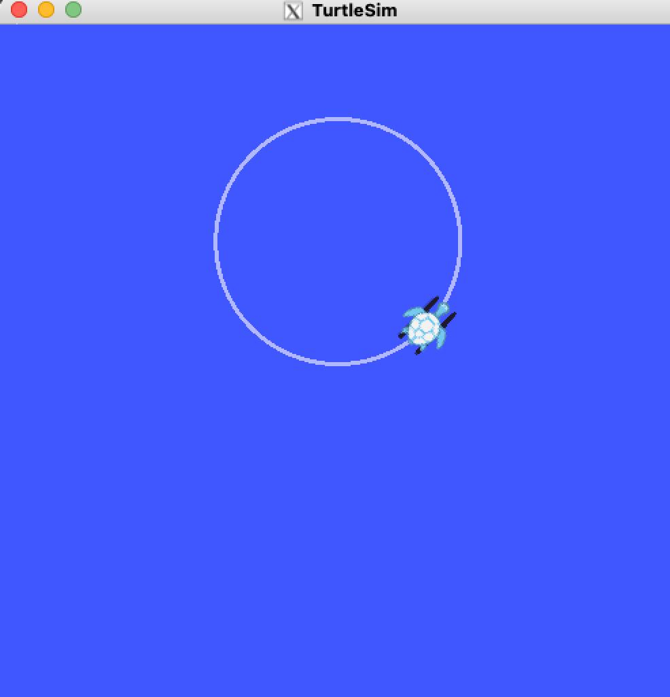

# 🤖 ROS Noetic Cloud Deployment on AWS

Welcome! This project demonstrates how to deploy **ROS Noetic** on an **AWS EC2 Ubuntu 20.04 instance** to simulate and test robotics applications — all from the cloud. Whether you're experimenting with topics, running turtlesim, or writing your first custom node, this guide walks through it from launch to publish.

---

## 🌟 Objective

To set up a cloud-based development environment for ROS (Robot Operating System) using AWS and Ubuntu, allowing remote simulations and experimentation with publisher-subscriber models.

---

## 🧰 Technologies Used

- 🟦 AWS EC2 (t2.micro, 30GB storage)
- 🐧 Ubuntu 20.04 LTS
- 🤖 ROS Noetic (Desktop-Full)
- 🐍 Python 3
- 🐢 turtlesim
- 🌐 Git & GitHub

---

## ⚙️ Project Setup

## 1. Launch an EC2 Instance
- Image: Ubuntu 20.04
- Type: `t2.micro`
- Storage: 30 GB
- Inbound rules: Allow SSH (port 22)

## 2. Install ROS Noetic

sudo apt update

sudo apt install curl -y

sudo sh -c 'echo "deb http://packages.ros.org/ros/ubuntu $(lsb_release -sc) main" > /etc/apt/sources.list.d/ros-latest.list'

curl -s https://raw.githubusercontent.com/ros/rosdistro/master/ros.asc | sudo apt-key add -

sudo apt update

sudo apt install ros-noetic-desktop-full -y

echo "source /opt/ros/noetic/setup.bash" >> ~/.bashrc

source ~/.bashrc

## 3. 🐍  First Publisher Node

This `talker.py` node publishes velocity commands (`geometry_msgs/Twist`) to `/turtle1/cmd_vel`. It makes the turtle move in a curve.

### 🧠 Code Snippet (talker.py)

pub = rospy.Publisher('/turtle1/cmd_vel', Twist, queue_size=10)
msg.linear.x = 2.0
msg.angular.z = 1.0
pub.publish(msg)

## 4. 🐢 Add a Subscriber Node

This `listener.py` node subscribes to `/turtle1/pose` and logs the turtle’s current position and heading.

### 🧠 Code Snippet (listener.py)

rospy.Subscriber('/turtle1/pose', Pose, callback)

def callback(data):
    rospy.loginfo(f"Turtle Pose → x: {data.x:.2f}, y: {data.y:.2f}, theta: {data.theta:.2f}")

---

##  📸 TurtleSim GUI Demo

Here's a screenshot of the turtle moving in the simulation (remotely run via ROS Noetic on AWS EC2):

---

## 👩‍💻 About the Author

**Pranitha Gokamala**  
Robotics & Cloud enthusiast — passionate about building intelligent systems, simulating behavior in the cloud, and making robots move!  
Let’s build something meaningful — one node at a time. 🧠⚙️

